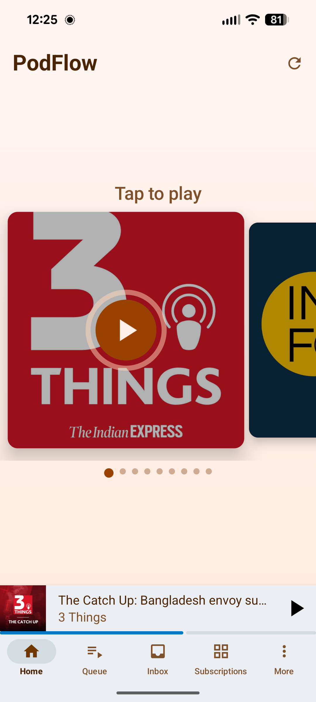
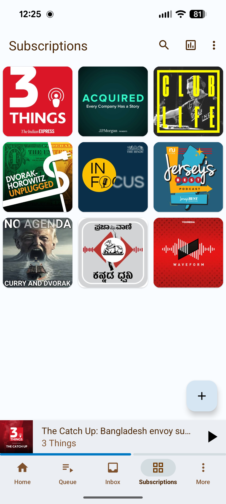
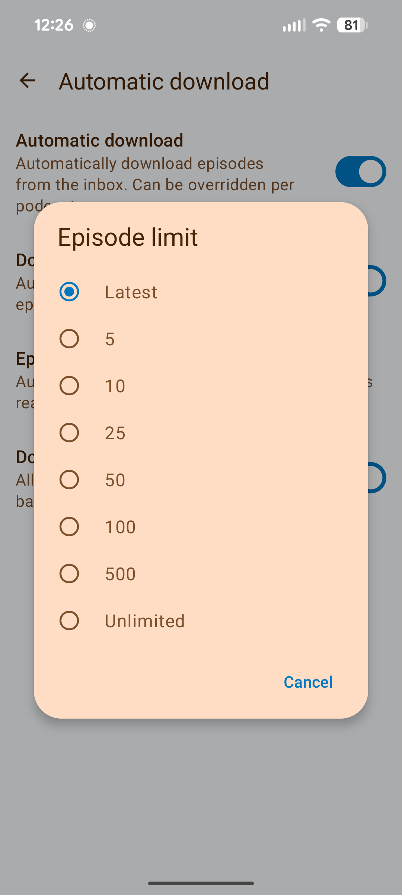
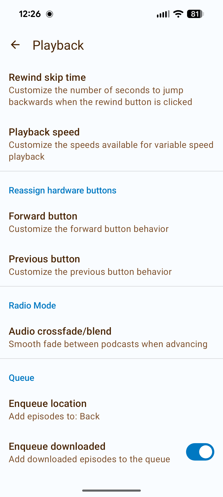
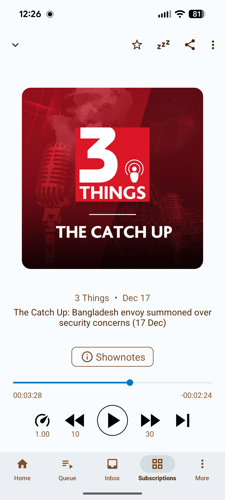

# PodFlow

PodFlow is a fork of [AntennaPod](https://github.com/AntennaPod/AntennaPod) modified for continuous playback with automatic episode management.

<table>
  <tr>
    <td></td>
    <td></td>
    <td></td>
    <td></td>
    <td></td>
  </tr>
</table>

## What's Different from AntennaPod

### Core Modifications

**Radio Mode**
- Automatic playback: Episodes advance to the next podcast when finished
- Automatic deletion: Played episodes are removed when the next episode from that podcast is downloaded
- Volume normalization: Audio levels are equalized across different podcasts using Android's DynamicsProcessing API
- Gapless playback: Seamless transitions between podcasts using Media3's built-in gapless support
- Skip podcast controls: Dedicated buttons in player to jump to previous/next podcast
- Wrap-around playback: Plays through all podcasts in sequence, loops back to start
- Default behavior: Enabled on fresh installs

**Home Screen**
- Horizontal carousel of podcast covers for quick visual selection
- Direct playback: Tap any podcast cover to start playing
- Visual states: Unplayed (full color), In-progress (progress ring), Completed (grayed out)
- Session tracking: Completed podcasts gray out, progress persists across app restarts
- Daily reset: Fresh session each day with all podcasts unplayed
- Sorting: Podcasts ordered by latest episode date
- Implemented using Jetpack Compose

**Download Behavior**
- Latest episode only: Auto-download retrieves only the most recent unplayed episode per podcast
- Multi-episode support: Downloads all episodes if multiple are published on the same day
- HTTP 416 handling: Prevents re-downloading already downloaded files

**Inbox Display**
- Episode count: Shows total new episodes across all podcasts (not podcast count)

**Queue (Playlist Management)**
- The queue is your playlist: Episodes play in queue order from top to bottom
- Drag to reorder: Long-press and drag episodes to change playback sequence
- Auto-advances: When an episode finishes, the next queued episode plays automatically
- Add episodes: Swipe or tap "Add to Queue" on any episode to include it
- Remove episodes: Swipe to remove from queue without deleting the download
- Lock queue: Prevent accidental reordering with the lock toggle
- Smart enqueue: New downloads automatically added to queue (configurable position: front, back, or after current)

### Comparison Table

| Feature | AntennaPod | PodFlow |
|---------|------------|---------|
| Home screen | Episode list | Horizontal podcast carousel |
| Episode selection | Manual | Automatic (latest) |
| Playback flow | Manual queue management | Automatic advancement with wrap-around |
| Audio transitions | None | Gapless playback (Media3) |
| Session tracking | None | Daily session with visual progress |
| Download strategy | All new episodes | Latest episode per podcast |
| Episode lifecycle | Manual deletion | Auto-delete after playback |
| Volume handling | Per-episode manual boost | Automatic normalization |
| Default mode | Standard playback | Radio Mode |

### Feature Details

**Radio Mode Playback Logic**
- Checks for additional same-day episodes from current podcast first
- Advances to next podcast with downloaded episodes if none found
- Respects skip intro/outro settings per podcast
- Gapless transition using Media3's built-in playlist support

**Download Algorithm**
- Queries for latest episode per subscribed podcast
- Downloads if episode is unplayed and not already downloaded
- Handles same-day multi-episode scenarios
- Prevents duplicate downloads via HTTP range requests

**Volume Normalization**
- LoudnessEnhancer: Adjusts perceived loudness to target level
- DynamicsProcessing: Compresses dynamic range and limits peaks
- Auto-enabled: Activates when Radio Mode is enabled
- Per-podcast override: Can be disabled in podcast settings

### Inherited Features

All standard AntennaPod features remain available:
- Variable playback speed (0.5x-3x)
- Silence trimming
- Sleep timer with shake-to-reset
- Chapter support
- OPML import/export
- Streaming and offline playback
- Chromecast support
- Per-podcast skip intro/outro settings

---

## Complete Changelog from AntennaPod

This section documents all modifications made to the AntennaPod codebase to create PodFlow.

### Core Features Added

#### 1. **Radio Mode** (`772aad2bd`, `2f7efcab6`, `88fb8b93e`, `79f567a9d`, `68dafad7d`)
- **New playback mode** that auto-advances to the next podcast when an episode finishes
- **Auto-deletion**: Episodes are automatically deleted after playback (smart deletion - only when next episode arrives)
- **Volume normalization**: Real-time audio processing using Android's `LoudnessEnhancer` and `DynamicsProcessing` APIs
- **Gapless playback**: Seamless transitions using Media3's built-in gapless support
- **Skip behavior**: Skip button marks episode as listened and advances to next podcast (no deletion)
- **Enabled by default**: Radio Mode is the default experience for new installs

**Files Modified:**
- `playback/service/src/main/java/de/danoeh/antennapod/playback/service/PlaybackService.java`
  - Added Radio Mode playback logic
  - Implemented `getNextInQueue()` override for Radio Mode
  - Volume normalization integration
- `playback/service/src/main/java/de/danoeh/antennapod/playback/service/internal/ExoPlayerWrapper.java`
  - Integrated `LoudnessEnhancer` and `DynamicsProcessing` for volume normalization
- `storage/database/src/main/java/de/danoeh/antennapod/storage/database/DBReader.java`
  - Added `getNextForRadioMode()` method (lines 499-522)
  - Added `getNextSameDayEpisode()` helper (lines 528-557)
  - Added `getNextPodcastEpisode()` helper (lines 564-602)
- `storage/preferences/src/main/java/de/danoeh/antennapod/storage/preferences/UserPreferences.java`
  - Added Radio Mode preference flags (lines 71-74)
  - Added volume normalization preferences (lines 958-997)

#### 2. **Carousel Home Screen** (`77104c903`, `280874a38`)
- **Jetpack Compose UI**: Modern, horizontal carousel of podcast covers
- **One-tap play**: Tap any podcast cover to instantly start the latest episode
- **Visual states**: Unplayed (full color, play icon), In-progress (progress ring), Completed (grayed, checkmark)
- **Session tracking**: Daily session persists completion state and playback position
- **Daily reset**: Session automatically resets each day for fresh content
- **Date sorting**: Podcasts sorted by latest episode date (newest first)
- **Set as default home page**: Replaces traditional episode-centric feed

**Files Created:**
- `app/src/main/kotlin/de/danoeh/antennapod/ui/screen/home/carousel/CarouselHomeScreen.kt`
  - Jetpack Compose UI with horizontal LazyRow
  - Visual states for unplayed/in-progress/completed
  - Progress indicator dots
- `app/src/main/kotlin/de/danoeh/antennapod/ui/screen/home/carousel/CarouselHomeViewModel.kt`
  - ViewModel for managing podcast list and session state
  - Sorting by latest episode date
- `app/src/main/kotlin/de/danoeh/antennapod/ui/screen/home/carousel/CommuteSession.kt`
  - Data model for daily session tracking
  - Persistence via SharedPreferences
- `app/src/main/kotlin/de/danoeh/antennapod/ui/screen/home/tiled/TiledHomeFragment.kt`
  - Fragment wrapper for Compose UI

**Files Modified:**
- `app/src/main/java/de/danoeh/antennapod/activity/MainActivity.java`
  - Changed default home fragment to `TiledHomeFragment` (line 410-412)
  - Added navigation support for carousel home

#### 3. **Smart Latest-Only Downloads** (`772aad2bd`, `1fce9c9bf`)
- **One episode per podcast**: Auto-download only downloads the latest unplayed episode
- **Same-day multi-episode support**: If podcast publishes multiple episodes on same day, all are downloaded
- **HTTP 416 handling**: Properly handles already-downloaded files without re-downloading
- **Auto-download on subscription**: New subscriptions automatically download latest episode

**Files Modified:**
- `net/download/service/src/main/java/de/danoeh/antennapod/net/download/service/episode/autodownload/AutomaticDownloadAlgorithm.java`
  - Modified logic to download only latest episode per podcast (85+ line changes)
  - Added same-day multi-episode detection
- `net/download/service/src/main/java/de/danoeh/antennapod/net/download/service/feed/remote/HttpDownloader.java`
  - Added HTTP 416 (Range Not Satisfiable) handling for resume support

#### 4. **Smart Inbox** (`772aad2bd`)
- **Accurate episode count**: Shows total NEW episodes across all podcasts (not just podcast count)
- **Swipe actions**: Swipe to mark as listened and auto-advance to next

**Files Modified:**
- `app/src/main/java/de/danoeh/antennapod/ui/screen/home/sections/InboxSection.java`
  - Fixed inbox count calculation to show episode count
- `app/src/main/java/de/danoeh/antennapod/ui/screen/InboxFragment.java`
  - Updated swipe behavior for Radio Mode

### Bug Fixes

#### Radio Mode Crash Fixes
- **Lambda variable scope fix** (`68dafad7d`): Fixed `ClassCastException` where `nextItem` variable wasn't final in lambda expressions
- **Audio threading crash fix** (`79f567a9d`): Fixed thread safety issues in blend transitions
- **Blend time preference fix** (pending): Fixed `ClassCastException` when reading blend time preference (String vs Integer type mismatch)

#### Other Fixes
- **OPML import auto-download** (`1fce9c9bf`): Fixed auto-download triggering on OPML import
- **HTTP 416 handling** (`1fce9c9bf`): Fixed download resume for already-downloaded files

### UI/UX Changes

#### Branding
- **Rebranded from AntennaPod to PodFlow** (`111bf068b`, `def690fe1`)
- **New app icon** (`1fce9c9bf`)
- **Updated screenshots** (`def690fe1`, `a7208f5fa`, `3c935d6f5`)
- **Material 3 theme**: Custom color scheme and typography

**Files Created:**
- `app/src/main/kotlin/de/danoeh/antennapod/ui/theme/Color.kt`
- `app/src/main/kotlin/de/danoeh/antennapod/ui/theme/Type.kt`
- `app/src/main/kotlin/de/danoeh/antennapod/ui/theme/Shape.kt`
- `app/src/main/kotlin/de/danoeh/antennapod/ui/theme/Theme.kt`

#### Settings UI
- Radio Mode settings in Playback preferences
- Volume normalization toggle

**Files Modified:**
- `ui/preferences/src/main/res/xml/preferences_playback.xml`
  - Radio Mode preference switches

### Configuration Changes

#### Default Settings (for Fresh Installs)
- Radio Mode: **ON** (was OFF)
- Volume normalization: **ON** (was OFF)
- Auto-download: **ON** (unchanged)

#### Build Configuration
- Package name: `app.podflow.player` (was `de.danoeh.antennapod`)
- App name: PodFlow (was AntennaPod)
- Updated icons and branding assets

**Files Modified:**
- `app/build.gradle`: Updated applicationId
- `build.gradle`: Updated dependencies
- `common.gradle`: Build configuration tweaks

### Documentation

#### New Documentation
- `docs/plans/2025-12-11-podflow-production-app-design.md`: Overall app design
- `docs/plans/2025-12-11-tiled-home-screen-design.md`: Tiled home screen design
- `docs/plans/2025-12-15-radio-mode-crash-fix-and-always-fresh-priority-design.md`: Radio Mode fixes and improvements

#### Updated Documentation
- `README.md`: Rebranded, updated features, added changelog
- `CONTRIBUTING.md`: Updated for PodFlow
- `CONTRIBUTORS.md`: PodFlow contributors

**Files Removed:**
- Cleaned up AntennaPod-specific documentation
- Removed outdated READMEs from submodules

### Testing

#### New Tests
- `app/src/test/kotlin/de/danoeh/antennapod/ui/screen/home/tiled/TiledHomeViewModelTest.kt`
  - Unit tests for TiledHomeViewModel

#### Modified Tests
- `app/src/androidTest/java/de/test/antennapod/ui/MainActivityTest.java`
  - Updated for TiledHomeFragment as default

### File Structure Summary

**Total Files Changed:** 40+ files modified/created

**Major Components:**
- **Playback Service** (Radio Mode logic): 5 files
- **UI Layer** (Tiled Home, Theme): 12 files
- **Database/Storage** (Radio Mode queries): 3 files
- **Download System** (Smart downloads): 2 files
- **Preferences** (Settings): 3 files
- **Documentation**: 5 files
- **Build Config**: 3 files

### Key Technical Decisions

1. **Why Jetpack Compose for Tiled Home?**
   - Modern, declarative UI
   - Better performance for grid layouts
   - Easier state management

2. **Why Always-Fresh Playback Priority?**
   - True "radio" experience prioritizes latest content
   - Users who want sequential playback can use Queue
   - Dynamic re-evaluation on every transition

3. **Why Gapless Playback?**
   - Uses Media3's built-in gapless support for reliable, seamless transitions
   - No audio processing conflicts that cause choppy sound
   - Simpler and more reliable than custom crossfade

4. **Why Latest-Only Downloads?**
   - Reduces storage usage
   - Focuses on fresh content (radio philosophy)
   - Same-day multi-episode support handles edge cases

### Future Roadmap (Not Yet Implemented)

- Smart algorithm to mix fresh + older unplayed content
- User preference for "always fresh" vs "sequential" Radio Mode
- Visual indicator showing "up next in Radio Mode"
- Statistics/history of auto-played episodes
- Hilt dependency injection migration

---

## Technology Stack

PodFlow builds on AntennaPod's mature codebase while adding modern Android components for new features.

| Component | AntennaPod (Inherited) | PodFlow (Added) |
|-----------|------------------------|-----------------|
| Language | Java | + **Kotlin** |
| UI Framework | XML Views + Fragments | + **Jetpack Compose** (carousel home) |
| Design System | Material 2 | + **Material 3** (new screens) |
| Architecture | MVP-style | + **MVVM** (Compose screens) |
| Async | RxJava3 | + **Kotlin Coroutines** |
| DI | Manual/Service Locator | Hilt (planned) |
| Database | Room | Room |
| Networking | OkHttp | OkHttp |
| Image Loading | Glide | + **Coil** (Compose screens) |
| Media | ExoPlayer (single) | ExoPlayer (gapless playback) |

**Note**: PodFlow is a hybrid codebase. New features (carousel home) use modern Kotlin/Compose, while inherited screens (subscriptions, queue, settings) retain the original Java/XML implementation. This allows rapid feature development while maintaining stability of the battle-tested AntennaPod core.

## Building from Source

### Prerequisites
- Android Studio Hedgehog or newer
- JDK 17
- Android SDK with API 35

### Build Steps

```bash
# Clone the repository
git clone https://github.com/usathyan/PodFlow.git
cd podflow

# Build debug APK
./gradlew :app:assembleFreeDebug

# Install on connected device
./gradlew :app:installFreeDebug
```

## Project Structure

```
app/src/main/kotlin/de/danoeh/antennapod/
├── ui/
│   ├── theme/              # Material 3 theme (Color, Type, Shape, Theme)
│   └── screen/
│       ├── home/
│       │   ├── carousel/   # Carousel home screen (CommuteSession, ViewModel, UI)
│       │   └── tiled/      # Fragment wrapper
│       ├── player/         # Now Playing screen (skip podcast buttons)
│       └── discover/       # Discovery/Search screen
```

## License

PodFlow is licensed under the **GNU General Public License v3.0 (GPL-3.0)**.

This is a derivative work of [AntennaPod](https://github.com/AntennaPod/AntennaPod), an open-source podcast manager for Android.

### Attribution

```
PodFlow is built on the foundation of AntennaPod,
an open-source podcast manager for Android.
https://github.com/AntennaPod/AntennaPod

This app is free software licensed under GPL v3.
```

## Contributing

Contributions are welcome! Please read our contributing guidelines before submitting PRs.

## Acknowledgments

- [AntennaPod](https://github.com/AntennaPod/AntennaPod) - The foundation this app is built upon
- [Material Design 3](https://m3.material.io/) - Design system
- [Jetpack Compose](https://developer.android.com/jetpack/compose) - Modern Android UI toolkit

## Contact

- Issues: [GitHub Issues](https://github.com/usathyan/PodFlow/issues)

---

Made with love for podcast lovers everywhere.
