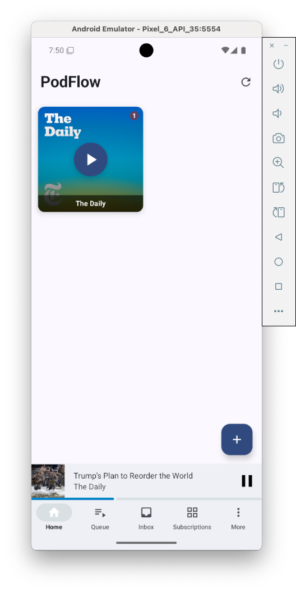
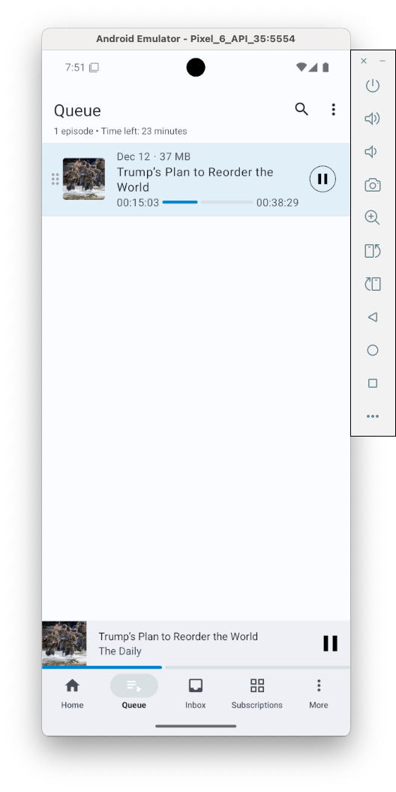
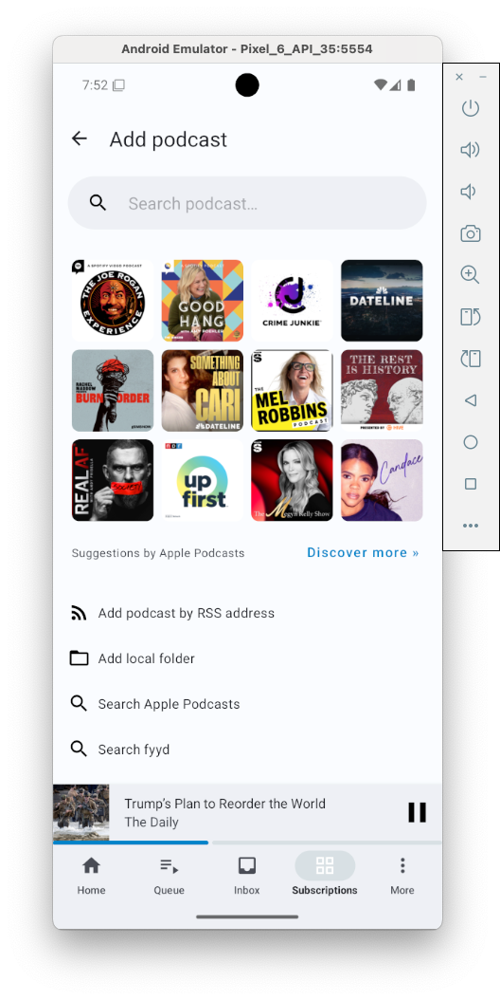
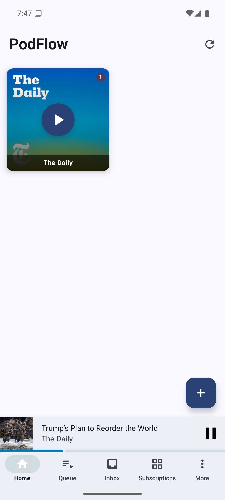
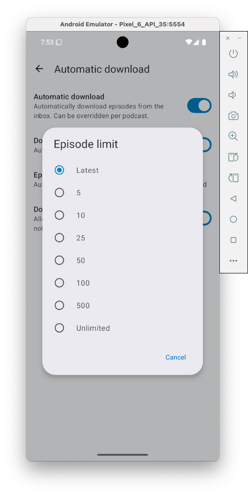

# PodFlow - Modern Podcast Player

> Your podcasts, flowing seamlessly

PodFlow is a fork of [AntennaPod](https://github.com/AntennaPod/AntennaPod) redesigned for a **radio-like listening experience**. Instead of managing individual episodes, PodFlow focuses on automatic playback with minimal interaction - just pick a podcast and listen.

---

## How PodFlow Differs from AntennaPod

| Feature | AntennaPod | PodFlow |
|---------|------------|---------|
| **Home Screen** | Episode-centric feed | Tiled podcast grid with one-tap play |
| **Auto-Download** | Downloads all new episodes | Downloads only the latest episode per podcast |
| **Radio Mode** | Not available | Auto-deletes played episodes, auto-advances to next |
| **Volume Normalization** | Manual boost only | Real-time audio normalization across podcasts |
| **Episode Management** | Manual queue management | Automatic - episodes disappear after playing |
| **Philosophy** | Full podcast management | Hands-off radio experience |

### Key PodFlow Features

- **Radio Mode** - Enable from home screen menu. Episodes auto-delete after playback and volume is normalized across all podcasts for seamless listening.
- **Smart Latest-Only Downloads** - Only downloads the most recent episode from each podcast. If a podcast drops multiple episodes on the same day, all are downloaded.
- **Tiled Home Screen** - Visual grid of your podcasts. Tap to play instantly. Configurable 2/3/Auto columns with list view option.
- **Real-Time Volume Normalization** - Uses Android's DynamicsProcessing API to compress and limit audio, ensuring consistent volume across different podcasts.
- **Smart Inbox** - Shows only the latest new episode per podcast, not all accumulated episodes.

### App Navigation

| Screen | What it shows |
|--------|---------------|
| **Home** | Grid of podcast tiles with play buttons. Tap to play the latest downloaded episode. |
| **Queue** | Episodes queued for sequential playback. Drag to reorder. |
| **Inbox** | New episodes (one per podcast). Swipe to dismiss or add to queue. |
| **Downloads** | All downloaded episodes for offline listening. |

### Inherited from AntennaPod

PodFlow inherits all the great features from AntennaPod:
- Variable playback speed (0.5x - 3x) with per-podcast settings
- Silence trimming (Smart Speed)
- Sleep timer with shake-to-reset and fade-out
- Chapter support and transcript viewing
- OPML import/export
- Streaming and offline playback
- Chromecast support

---

## Technology Stack

| Component | Technology |
|-----------|------------|
| Language | Kotlin 2.0+ |
| UI Framework | Jetpack Compose |
| Design System | Material 3 |
| Architecture | MVVM + Clean Architecture |
| Async | Kotlin Coroutines + Flow |
| DI | Hilt (planned) |
| Database | Room |
| Networking | Retrofit + OkHttp |
| Image Loading | Coil |
| Media | Media3 (ExoPlayer) |

## Screenshots

<p float="left">





</p>

## Building from Source

### Prerequisites
- Android Studio Hedgehog or newer
- JDK 17
- Android SDK with API 35

### Build Steps

```bash
# Clone the repository
git clone https://github.com/usathyan/PodFlow.git
cd podflow

# Build debug APK
./gradlew :app:assembleFreeDebug

# Install on connected device
./gradlew :app:installFreeDebug
```

## Project Structure

```
app/src/main/kotlin/de/danoeh/antennapod/
├── ui/
│   ├── theme/              # Material 3 theme (Color, Type, Shape, Theme)
│   └── screen/
│       ├── home/tiled/     # Tiled home screen
│       ├── player/         # Now Playing screen
│       └── discover/       # Discovery/Search screen
```

## License

PodFlow is licensed under the **GNU General Public License v3.0 (GPL-3.0)**.

This is a derivative work of [AntennaPod](https://github.com/AntennaPod/AntennaPod), an open-source podcast manager for Android.

### Attribution

```
PodFlow is built on the foundation of AntennaPod,
an open-source podcast manager for Android.
https://github.com/AntennaPod/AntennaPod

This app is free software licensed under GPL v3.
```

## Contributing

Contributions are welcome! Please read our contributing guidelines before submitting PRs.

## Acknowledgments

- [AntennaPod](https://github.com/AntennaPod/AntennaPod) - The foundation this app is built upon
- [Material Design 3](https://m3.material.io/) - Design system
- [Jetpack Compose](https://developer.android.com/jetpack/compose) - Modern Android UI toolkit

## Contact

- Issues: [GitHub Issues](https://github.com/usathyan/PodFlow/issues)

---

Made with love for podcast lovers everywhere.
